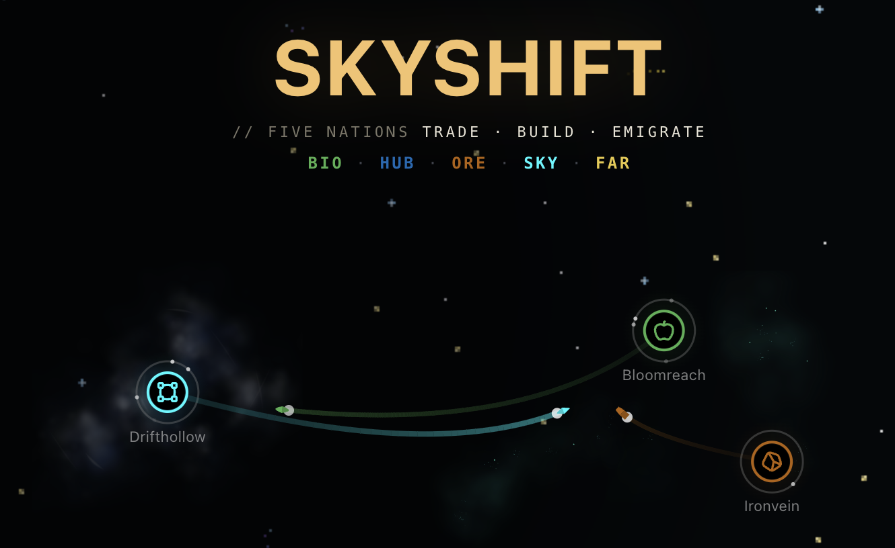
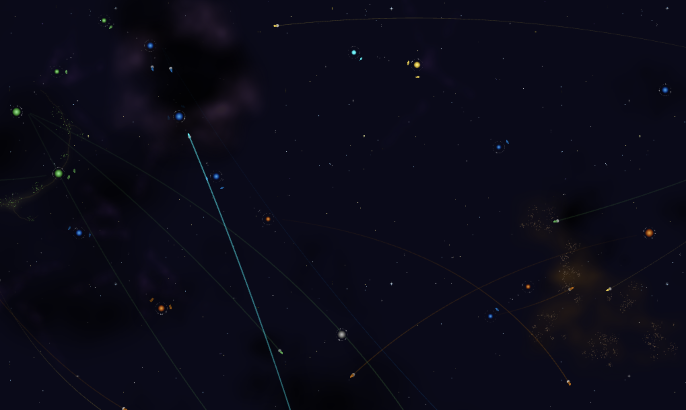
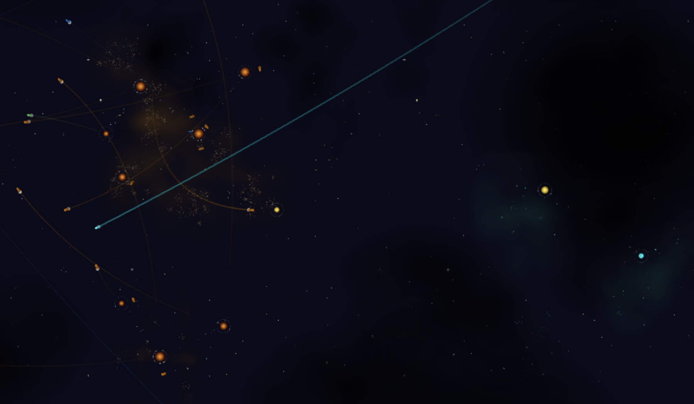
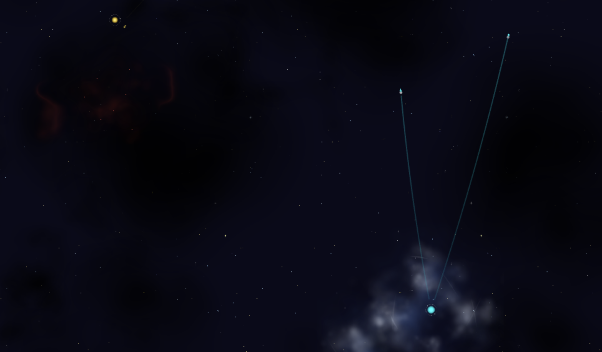
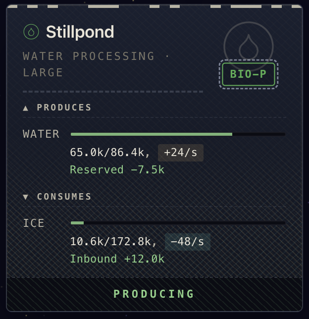
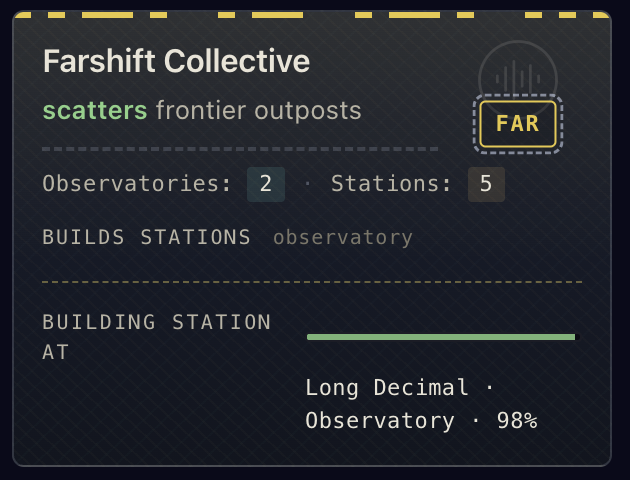
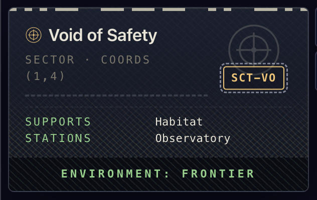
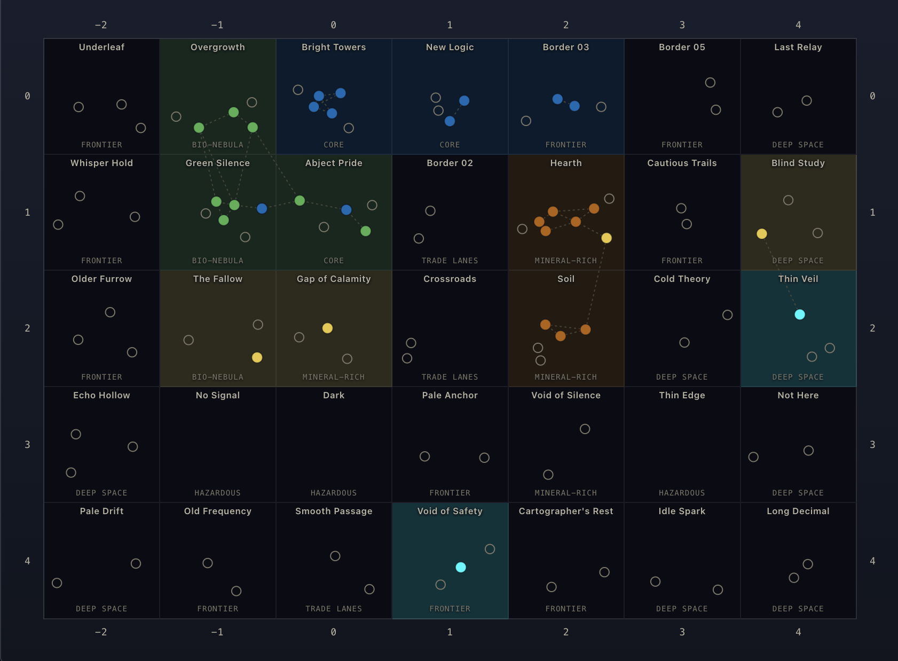
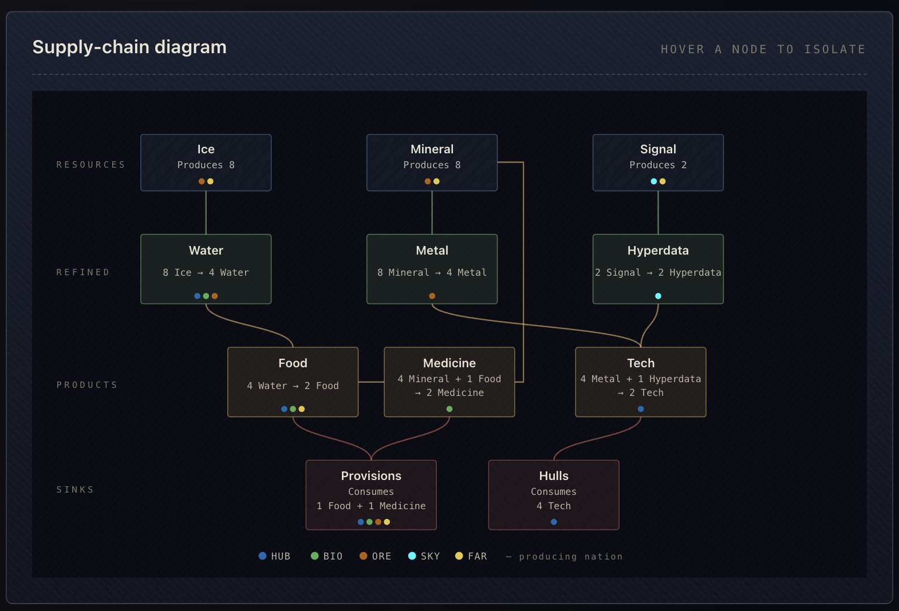
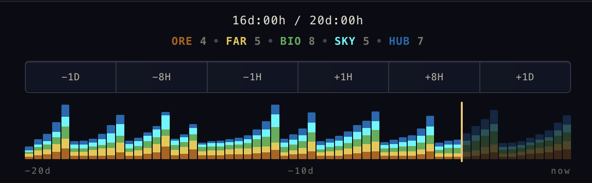

# Skyshift

**A self-running 2D space economy for your browser.** Five nations trade, build, and emigrate while ships keep stations supplied.

Skyshift is an ambient simulation: pleasant to leave open, and inspectable when you want the details.

Try it out: [skyshift.rudidev.com](https://skyshift.rudidev.com).

[](https://skyshift.rudidev.com)

## What you can do

Start a universe, then watch it run:

- Inspect stations, nations, sectors, inventories, and trade routes.
- Follow cargo ships as they move wares between stations.
- Speed time up and watch nations place new stations.
- See the universe make room for itself: stations depart on generational ships, reopening space for new construction.

Players choose whether emigration happens automatically or manually, and what share of stations leaves. This controls how often and how much sectors open up so nations can build again.

## The world

Two starts are offered:

- **Settled** starts with a balanced map, with nations comfortably set up based on their personalities.
- **Frontier** starts with an "early days" map and one of each essential station type, ready to expand.







## The user interface

The UI is inspired by official paperwork. The line-and-dot accents are Morse code versions of the panel titles.

<table>
  <tr valign="top">
    <td width="33%"></td>
    <td width="33%"></td>
    <td width="34%"></td>
  </tr>
</table>

## Under the hood

The joyful visuals sit on top of an economy simulation engine:

- **A headless economy core.** No rendering dependency! Run simulation with tools and scripts for development and fine-tuning.
- **A real supply model.** Stations produce and consume goods; ships choose routes based on shortage needs.
- **Universe grows and changes.** Nations construct stations; emigration removes them.
- **Nations have personalities.** Hub-Cluster builds near their core systems, Bio-Annex prefers celestial tree nebulas, Mining Fleet prefers mineable asteroids, Skyshift jumps into deep space, and Farshift scatters frontier observatories.
- **Browser-first.** Built with TypeScript, Vite, and Phaser v4 so the project stays one click away from trying.

## Agent skills

Located at [`.claude/skills/`](.claude/skills/). Since the LLM field is moving rapidly, these can become obsolete pretty quickly, so think of these as a snapshot of what was used with the project. Usually include separate markdown file with before/after code samples and explanation why.

- **deep-simplify:** looks for dead code, redundancies, unnecessary wrappers, and ways to combine logic into simpler structure.
- **review-structure:** naming, coding patterns and organization. Iterated on while working on this repo early on.
- **review-tests:** makes small (wrong) changes to code, and sees how tests react.
- **iterate-skill:** run skill on files few times, ironing out issues. Highly experimental.
- **compress-skill:** rewrite skill prose to terse bullets while preserving the important parts.
- **generate-image:** procedurally generates and updates game textures like nebulas and backgrounds.

## Run it locally

```bash
npm install
npm run dev
```

## Testing and stability

- **Headless simulation:** entire economy flow: trade, saves, construction, and emigration (tsx: src/tests/*.test.ts).
- **Static pages:** loads each page and looks for console error and basic interaction failures. No in-depth functionality tests (Puppeteer: dev/static-tests/*.test.mjs).
- **Economy report:** long-run shortages, stalls, and balance gaps. Mostly obsolete by timelapse tool, which is visually easier to follow (bash: dev/economy/report.sh).
- **Heap leak check:** looks for memory leaks while the universe runs for longer period of time (Puppeteer: dev/performance/heap-leak-check.mjs).
- **Scene switch check:** looks for Phaser objects left behind between starts (Puppeteer: dev/performance/scene-switch-check.mjs).
- **Frame jank trace:** garbage collection pauses and per-frame stutter (Puppeteer: dev/performance/frame-jank-check.mjs).

## Tools and reference pages

The project includes supporting pages that expose the same data used by the game.

The lore page includes a full universe map:



It also shows the ware production chain:



The tools page includes a timelapse strip of station changes (also available in-game). Running the simulation for 20 in-game days is a useful way to notice economy gaps and stalling.



More is available on:

- **Tools:** timelapse, map editor, and economy editor.
- **Lore:** in-game data for nations, ships, stations, sectors, and wares.
- **Design:** a reference sheet of the UI components.

## Principles

- **Accessible and runs everywhere**

  Runs in any modern browser, desktop or mobile.

- **Living world**

  A world that changes and evolves on its own: watch it change over time.

- **Joyful**

  It's not a screensaver, but should be pleasing to look like it's one!

## Credits & license

Skyshift is released under the [MIT License](LICENSE.md) — use it however you like, just keep the copyright and license notice.

Third-party components, with full license texts in [`THIRD-PARTY-NOTICES.md`](THIRD-PARTY-NOTICES.md):

- [Phaser](https://phaser.io) v4 — game framework (MIT)
- [Lucide](https://lucide.dev) icons (ISC), some derived from [Feather](https://feathericons.com) (MIT)
- Typefaces: Space Grotesk and JetBrains Mono (SIL Open Font License 1.1)
